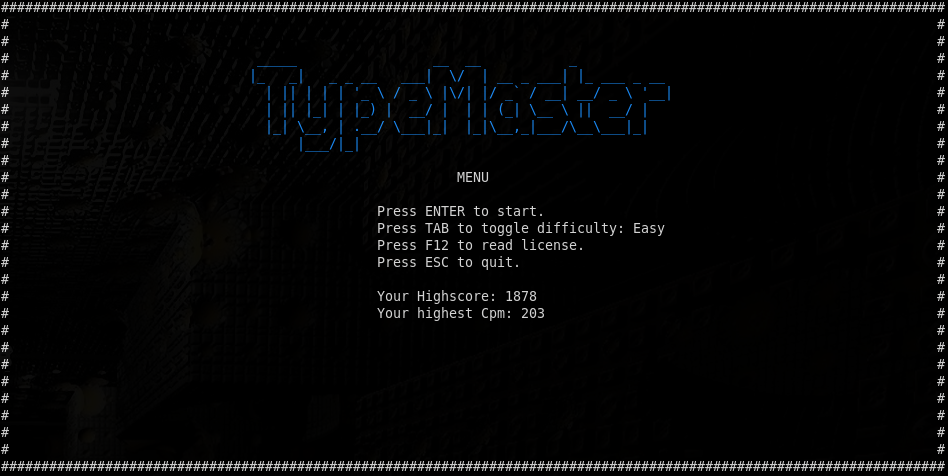
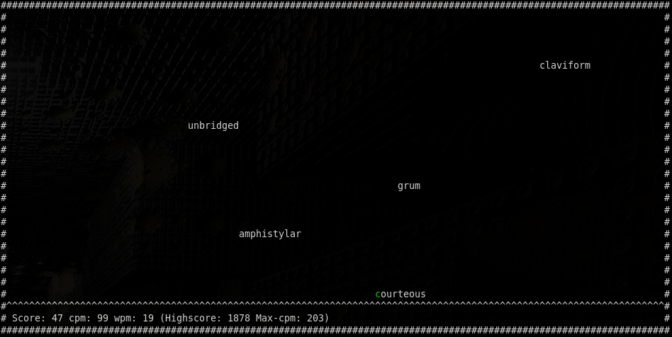

# typemaster


Typemaster is a typetrainer-game that helps to increase your speed in typewriting,
it runs in your terminal using [console_engine](https://crates.io/crates/console_engine)

This software is written in Rust.




## Installation

### Linux and other

First install cargo.

Compile the typemaster-crate:

```
cargo install typemaster
```
